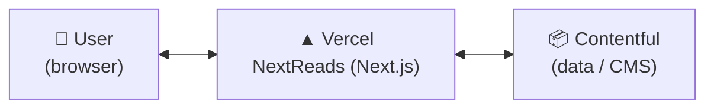

# NextReads

**Search, discover and organize your books.**

[**🌐 Live Demo**](https://hci-project-three.vercel.app/) · [**📄 Final Report**](https://app.notion.com/p/NextReads-Search-discover-and-organize-your-books-2610424e489a80b7b89dcde756d059a2?source=copy_link)

---

## 📖 About

NextReads is a Goodreads-inspired web app for searching books, creating a reader profile and saving your favourites to a personal bookshelf.

## 🏗️ Architecture

- **Vercel** — hosts the app
- **Contentful** — stores all the data (books, authors, genres, lists, series, users)

## 📸 Screenshots

| Home page | Book details |
| :---: | :---: |
|  |  |

| Genres | My Books |
| :---: | :---: |
|  |  |

| Lists | Information architecture |
| :---: | :---: |
|  |  |

## 🛠️ Built With

Next.js · React · TypeScript · Tailwind CSS · Contentful · Vercel
