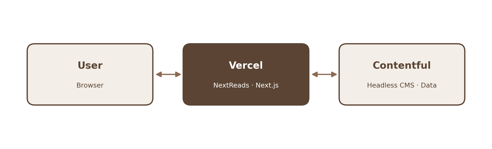
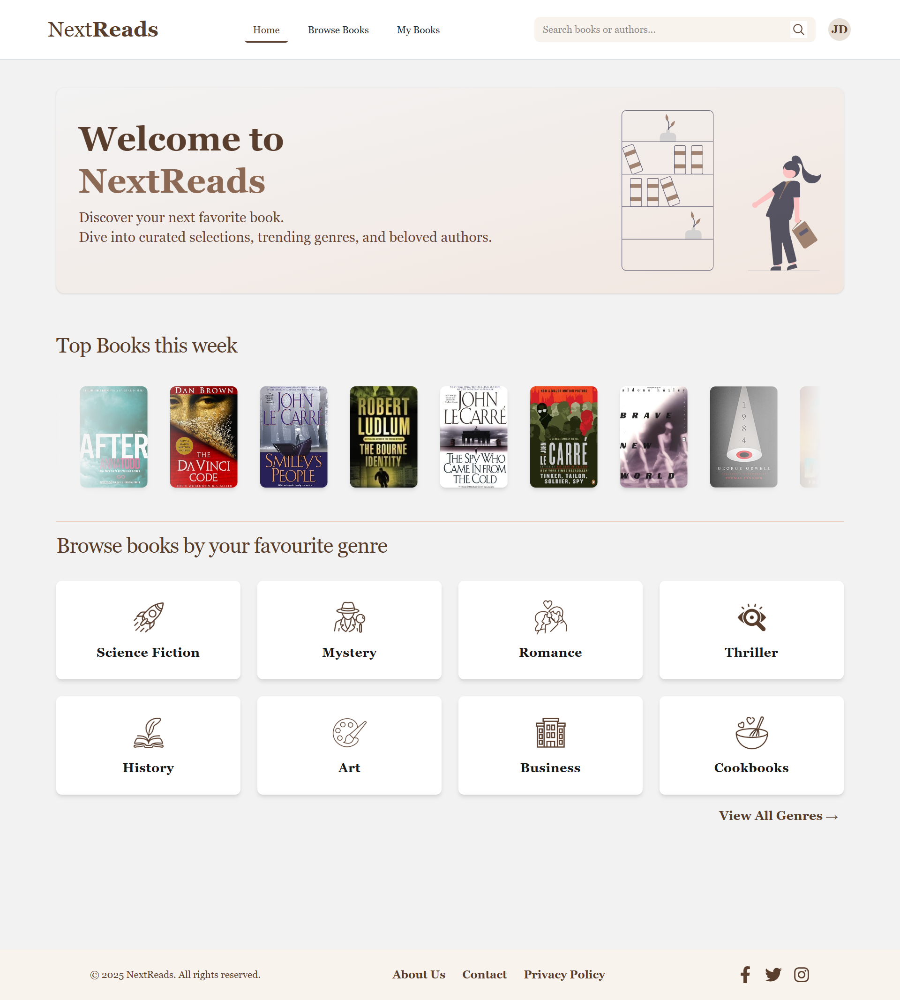
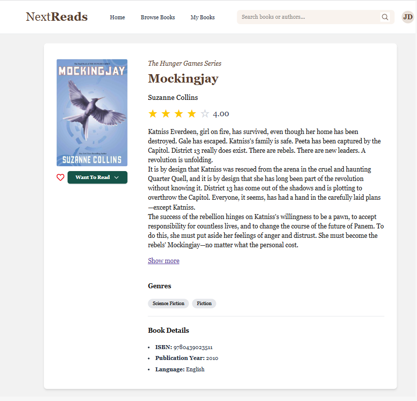
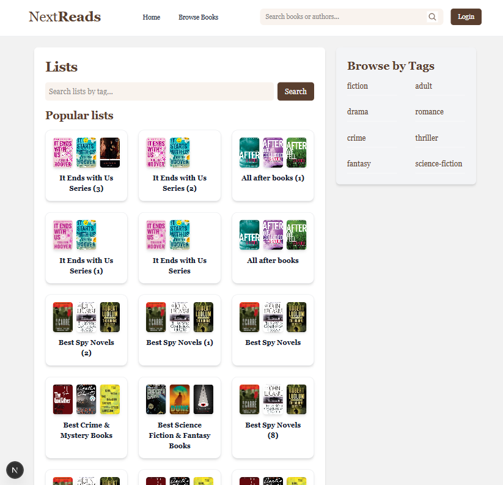
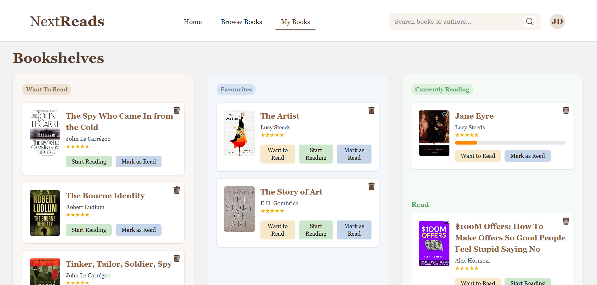

# NextReads

**Search, discover and organize your books.**

 

## About

NextReads is a Goodreads-inspired web app for searching books, creating a reader profile and saving your favourites to a personal bookshelf.

 

## Architecture

  

- **Vercel** — hosts the app
- **Contentful** — stores all the data (books, authors, genres, lists, series, users)

 

## Pages

  

 

## Screenshots

 

### Home page

  

 

### Browsing by Genre

  

 

### Book Details

  

 

### Lists

  

 

### My Books

  

 

## Technologies

Next.js · React · TypeScript · Tailwind CSS · Contentful · Vercel
